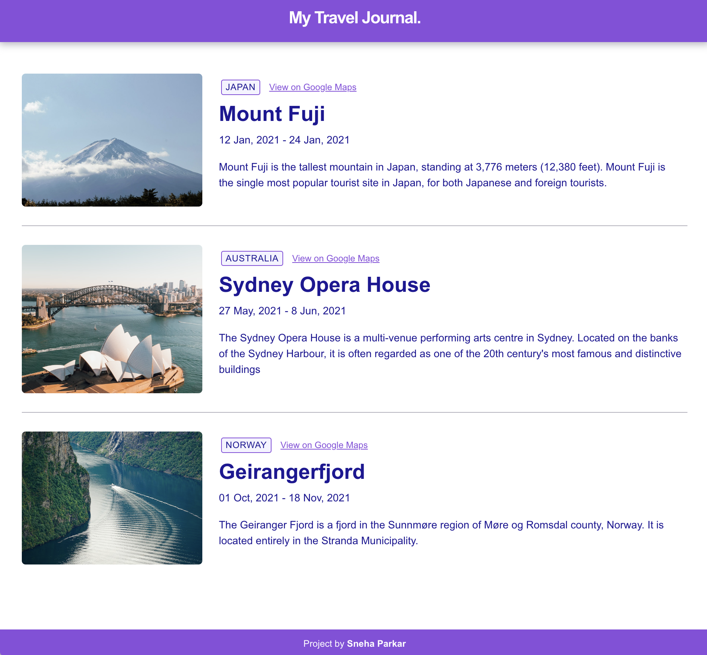

# Travel Journal (Scrimba React Course solo project)

### Requirements
This is a solution to the [Travel Journal solo project on Scrimba](https://scrimba.com/learn/learnjavascript/). Scrimba helps to improve your coding skills by building realistic projects.

- Reusable Components
- React Props
- array .map()
- Conditional Rendering
- Styling with Classes

### Screenshot

### Getting Started with Create React App

This project was bootstrapped with [Create React App](https://github.com/facebook/create-react-app).

## Available Scripts

If you want to see the final product, in the project directory, you can run:

## `npm start`

Runs the app in the development mode.\
Open [http://localhost:3000](http://localhost:3000) to view it in your browser.

### Built with

- Semantic HTML5 markup
- CSS custom properties
- React.JS
- Flexbox

## Author

- Website - [sneha parkar](https://snehaparkar.in)
